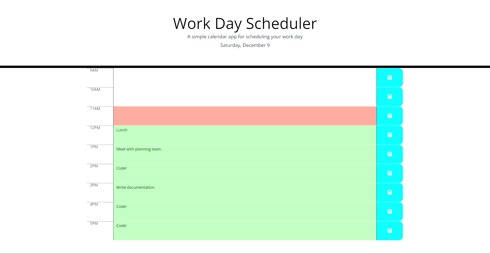

# Daily Planner

A calendar application that allows a user to save events for each hour of the day.

## Description

A web app written in javascript, HTML and CSS that displays a daily planner in which the user can record events that are stored locally.

A link to the application can be found here:

## Installation

THe project is a static webpage hosted on Github Pages so no installation is required apart from a web browser of your choice.

## Usage

The planner will colour the rows: grey rows are in the past, the red row is the current hour and the green rows are for the future. Click on a row in the middle column to add an event of your choice by typing it in. Click the corresponding 'save' icon in the blue column to save your event.

## Credits

https://stackoverflow.com/questions/11563638/how-do-i-get-the-value-of-text-input-field-using-javascript was used to understand how to get information out of a text input field in HTML.

## License

MIT License

Copyright (c) 2023 Thomas Fahy

Permission is hereby granted, free of charge, to any person obtaining a copy
of this software and associated documentation files (the "Software"), to deal
in the Software without restriction, including without limitation the rights
to use, copy, modify, merge, publish, distribute, sublicense, and/or sell
copies of the Software, and to permit persons to whom the Software is
furnished to do so, subject to the following conditions:

The above copyright notice and this permission notice shall be included in all
copies or substantial portions of the Software.

THE SOFTWARE IS PROVIDED "AS IS", WITHOUT WARRANTY OF ANY KIND, EXPRESS OR
IMPLIED, INCLUDING BUT NOT LIMITED TO THE WARRANTIES OF MERCHANTABILITY,
FITNESS FOR A PARTICULAR PURPOSE AND NONINFRINGEMENT. IN NO EVENT SHALL THE
AUTHORS OR COPYRIGHT HOLDERS BE LIABLE FOR ANY CLAIM, DAMAGES OR OTHER
LIABILITY, WHETHER IN AN ACTION OF CONTRACT, TORT OR OTHERWISE, ARISING FROM,
OUT OF OR IN CONNECTION WITH THE SOFTWARE OR THE USE OR OTHER DEALINGS IN THE
SOFTWARE.
